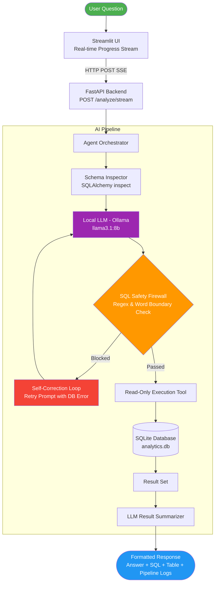

# 📊 SQL Analyst Agent — AI Database Assistant

An enterprise-grade, read-only AI SQL Analyst that answers complex natural language business questions by inspecting database schemas, generating safe SQLite queries, executing them through a multi-layer validation firewall, and explaining the results in plain English.

Built with **100% free open-source technology**: local LLM inference via **Ollama (Llama 3.1 8B)**, **FastAPI**, **SQLAlchemy**, **Streamlit**, and **Docker**.

---

## 🏗️ System Architecture



---

## ✨ Key Features

- **100% Free & Local Inference:** Powered by Ollama (**`llama3.1:8b`**) with zero external API fees.
- **Multi-Layer Security Firewall:**
  - Strict read-only enforcement (**`SELECT`** / **`WITH`** statements only).
  - Regex word-boundary protection blocking **`DROP`**, **`DELETE`**, **`UPDATE`**, **`INSERT`**, **`ALTER`**, **`TRUNCATE`**, **`ATTACH`**, **`PRAGMA`**.
  - Stacked statement rejection preventing multi-query SQL injection (**`SELECT ... ; DROP ...`**).
  - Strict result capping and query execution timeouts.
- **Self-Correcting Retry Loop:** Captures runtime database execution errors and feeds error messages back into the LLM context to correct syntax dynamically.
- **Real-Time Pipeline Progress:** Streams Server-Sent Events (SSE) to the Streamlit UI, providing live step-by-step visibility (**`Understanding`** `→` **`Schema Inspection`** `→` **`SQL Generation`** `→` **`Safety Validation`** `→` **`Execution`** `→` **`Summarization`**).
- **Comprehensive Evaluation Harness:** Includes a 15-question benchmark suite measuring SQL validity, execution success, latency, and ground-truth accuracy.
- **Full Containerization:** Dockerfile and Docker Compose setup orchestrating both the FastAPI backend and Ollama.

---

## 📈 Benchmark Evaluation Scorecard

Evaluated against 15 ground-truth business analytics queries:

| Metric | Score | Note |
| --- | --- | --- |
| **SQL Safety Validity Rate** | **100.0%** | Zero destructive/blocked queries passed security firewall |
| **Query Execution Success Rate** | **100.0%** | All generated queries executed cleanly without runtime syntax errors |
| **Ground-Truth Accuracy** | **73.3%** | Evaluated on local 8B model (**`llama3.1:8b`**) |
| **Average Query Latency** | **~35.06s** | CPU inference on local machine |

*See full details in [`EVALUATION_REPORT.md`](https://arena.ai/c/EVALUATION_REPORT.md).*

---

## 🛠️ Tech Stack

- **LLM Engine:** Ollama (**`llama3.1:8b`** / **`llama3.2:3b`**)
- **Frameworks:** LangChain, LangGraph
- **Backend API:** FastAPI, Uvicorn, Pydantic v2
- **Database / ORM:** SQLite, SQLAlchemy 2.0
- **Frontend UI:** Streamlit
- **Testing:** pytest, httpx
- **Containerization:** Docker, Docker Compose

---

## 🚀 Quick Start (Local Setup)

### Prerequisites

- Python 3.10+
- [**Ollama installed**](https://ollama.com/) and running locally (**`ollama pull llama3.1:8b`**)

### 1. Clone & Install Dependencies

```bash
git clone https://github.com/YOUR_USERNAME/sql-analyst-agent.git
cd sql-analyst-agent

python -m venv .venv
source .venv/bin/activate  # On Windows: .venv\Scripts\activate
pip install -r requirements.txt
```

### 2. Seed the Sample Database

```bash
python -m app.database.seed
```

### 3. Start Backend & Frontend

```bash
# Terminal 1: Start FastAPI Backend
python -m uvicorn app.main:app --reload

# Terminal 2: Start Streamlit Frontend
streamlit run app/frontend.py
```

Open **`http://localhost:8501`** in your browser.

---

## 🐳 Docker Deployment

Run both the API and Ollama engine using Docker Compose:

```bash
# 1. Seed database locally
python -m app.database.seed

# 2. Build and start containers
docker compose up --build -d

# 3. Download LLM model inside Ollama container
docker exec -it sql-analyst-ollama ollama pull llama3.1:8b
```

Access API documentation at **`http://localhost:8000/docs`**.

---

## 🔒 Security & Guardrails Design

1. **Schema Minimization:** Only table names, column names, data types, and key constraints are exposed to the LLM. Raw user data is never included in prompt context.
2. **Untrusted LLM Output:** Generated SQL is treated as untrusted input. It passes through regex word boundary validators before touching the database session.
3. **No Direct DB Driver Access:** The LLM cannot execute code directly. It only produces JSON/text tool calls handled by verified Python execution functions.

---

## 📄 License

MIT License. Free to use and modify for learning and commercial projects.
